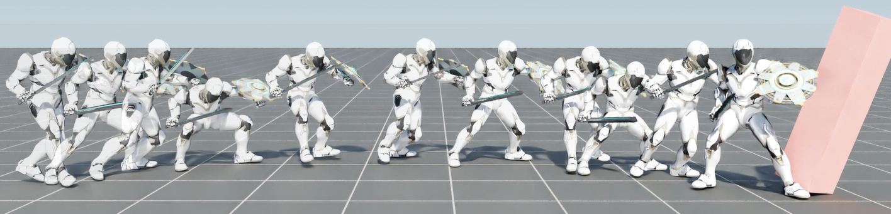

# PADL: Language-Directed Physics-Based Character Control

This is the project repository for the SIGGRAPH Asia 2022 paper "PADL: Language-Directed Physics-Based Character Control" by Jordan Juravsky, Yunrong Guo, Sanja Fidler, and Xue Bin Peng.

[[Project Page]](https://nv-tlabs.github.io/PADL/) [[Video]](https://www.youtube.com/watch?v=CJnUlpxOEdg)

Code coming soon!